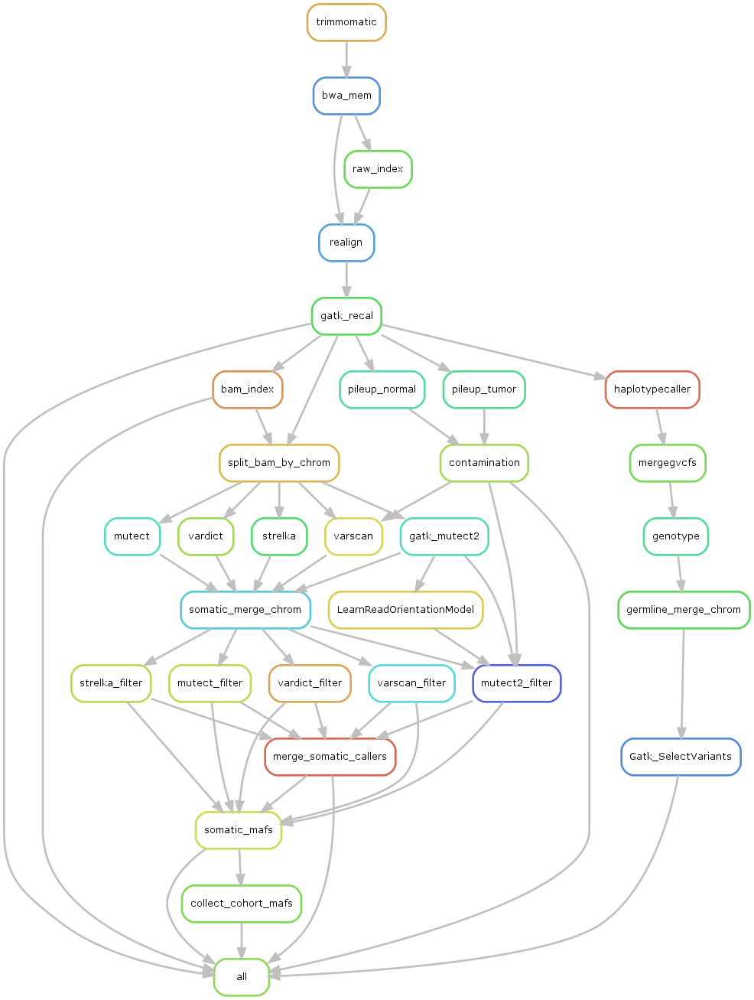
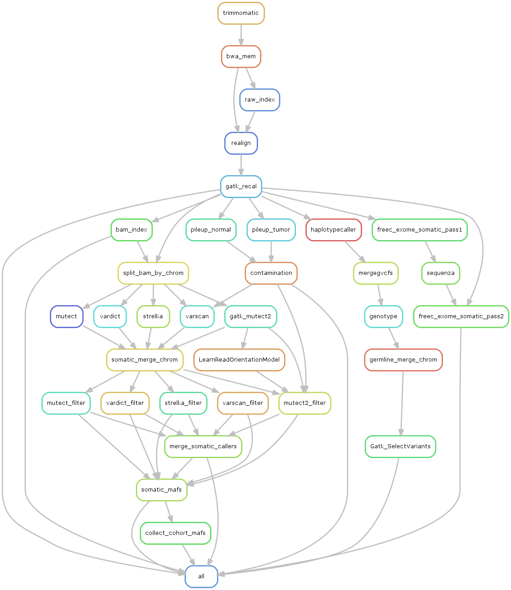

# Configurable pipeline steps

The configurable parameters are part of the `input_params` section of the [config JSON](https://github.com/mtandon09/exome_pipeline_dev_mt/blob/main/config_tests/references_hg38.json).
```
...
"input_params": {
      "FASTQ_SOURCE": "/data/tandonm/pl_test_data/human/fastq",
      "BAM_SOURCE": "/data/tandonm/pl_test_data/human/bams",
      "PAIRS_FILE": "pairs.tsv",
      "EXOME_TARGETS": "/data/CCBR_Pipeliner/db/PipeDB/lib/Agilent_SSv7_allExons_hg38.bed",
      "FFPE_FILTER": "True",
      "CNV_CALLING": "True"
    },
...
```

Depending on options defined in the config file, several combinations are possible.

---------------------------------------------------
## Start from FASTQ files

This is the relevant split of the [config file to start from FASTQ](https://github.com/mtandon09/exome_pipeline_dev_mt/blob/main/config_tests/example_configs/fromfq.json). `FASTQ_SOURCE` is a directory that contains paired fastq files, and `BAM_SOURCE` is left blank.
```
...
  "input_params": {
      "FASTQ_SOURCE": "/data/tandonm/pl_test_data/human/fastq",
      "BAM_SOURCE": "",
      "PAIRS_FILE": "pairs.tsv",
      "EXOME_TARGETS": "/data/CCBR_Pipeliner/db/PipeDB/lib/Agilent_SSv7_allExons_hg38.bed",
      "FFPE_FILTER": "False",
      "CNV_CALLING": "False"
  },
...
```




---------------------------------------------------
## Start from BAM files

This is the relevant split of the [config file to start from BAM](https://github.com/mtandon09/exome_pipeline_dev_mt/blob/main/config_tests/example_configs/frombam.json). `BAM_SOURCE` is a directory that contains pre-processed BAM files, and `FASTQ_SOURCE` is left blank.
```
...
  "input_params": {
      "FASTQ_SOURCE": "",
      "BAM_SOURCE": "/data/tandonm/pl_test_data/human/bams",
      "PAIRS_FILE": "pairs.tsv",
      "EXOME_TARGETS": "/data/CCBR_Pipeliner/db/PipeDB/lib/Agilent_SSv7_allExons_hg38.bed",
      "FFPE_FILTER": "False",
      "CNV_CALLING": "False"
  },
...
```


---------------------------------------------------
## Add copy number variant (CNV) calling

This is the relevant split of the [config file to include CNV calling](https://github.com/mtandon09/exome_pipeline_dev_mt/blob/main/config_tests/example_configs/withcnv.json).
`CNV_CALLING` can be set to any of (case-insensitive) `true`, `t`, or `yes`.
```
...
   "input_params": {
      "FASTQ_SOURCE": "/data/tandonm/pl_test_data/human/fastq",
      "BAM_SOURCE": "",
      "PAIRS_FILE": "pairs.tsv",
      "EXOME_TARGETS": "/data/CCBR_Pipeliner/db/PipeDB/lib/Agilent_SSv7_allExons_hg38.bed",
      "FFPE_FILTER": "False",
      "CNV_CALLING": "True"
  },
...
```




---------------------------------------------------
## Add FFPE artifact filtering

Currently using [`SOBDetector`](https://github.com/mikdio/SOBDetector) to flag FFPE artifacts for somatic calls only. 

This is the relevant split of the [config file to include FFPE artifact filtering](https://github.com/mtandon09/exome_pipeline_dev_mt/blob/main/config_tests/example_configs/withffpe.json) due to **S**trand **O**rientation **B**ias.
`FFPE_FILTER` can be set to any of (case-insensitive) `true`, `t`, or `yes`.

```
...
   "input_params": {
      "FASTQ_SOURCE": "/data/tandonm/pl_test_data/human/fastq",
      "BAM_SOURCE": "",
      "PAIRS_FILE": "pairs.tsv",
      "EXOME_TARGETS": "/data/CCBR_Pipeliner/db/PipeDB/lib/Agilent_SSv7_allExons_hg38.bed",
      "FFPE_FILTER": "False",
      "CNV_CALLING": "True"
  },
...
```


