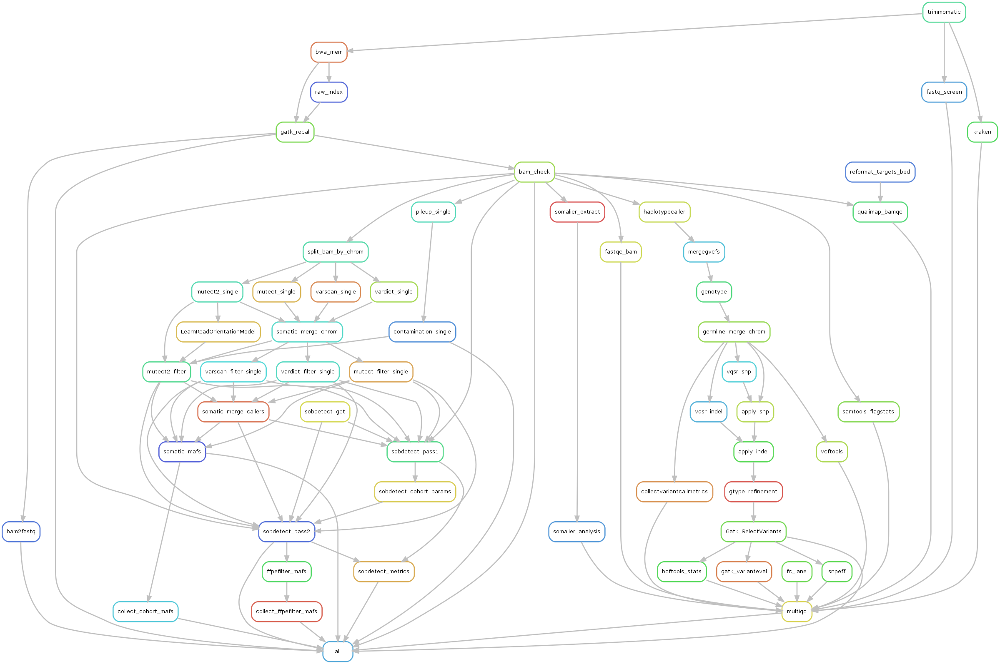

# Pipeline Overview 

---

 **Workflow diagram for the pipeline** 

---

This is the snakemake rule graph output with all options enabled, which shows more granular details of the steps.

---

 **DAG output from snakemake** 

