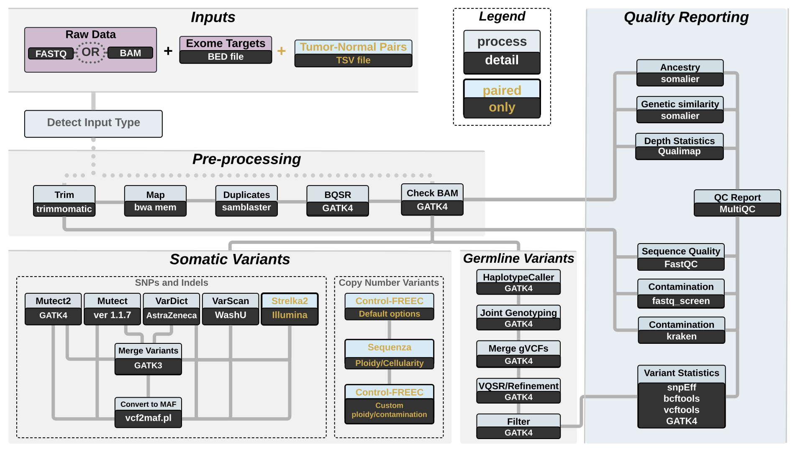

# Pipeline Overview 

> **Workflow diagram of the Exome-seek:** the pipeline is composed of a series of data processing steps to trim, align, and recalibrate reads prior to calling variants. These data processing steps closely follow GATK's best pratices for cleaning up raw alignments. The pipeline also consists of a series of comprehensive quality-control steps.
