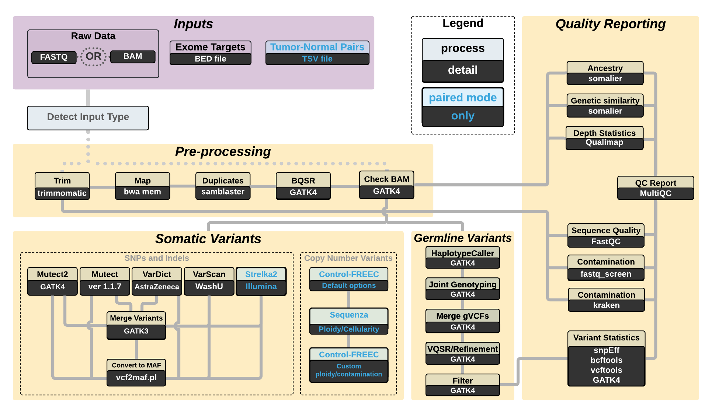

# Pipeline Overview 

This is the snakemake rule graph output.  This will be replaced with a more detailed diagram soon.

---

 **Workflow diagram for the pipeline** Somatic calling steps cluster to the left, and germline and QC steps to the right. 

