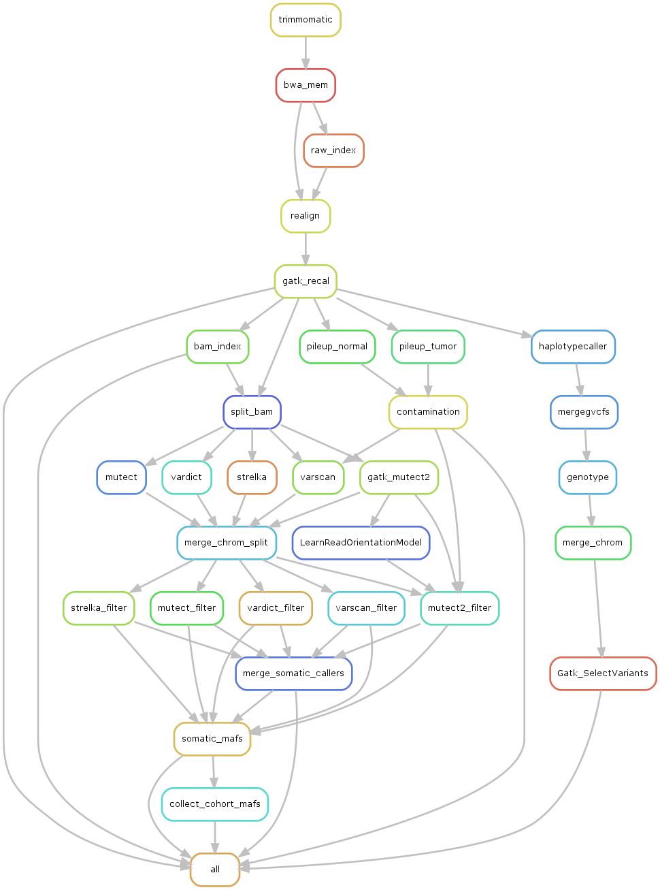

# Configurable pipeline steps

The configurable parameters are part of the `input_params` section of the [config JSON](https://github.com/mtandon09/exome_pipeline_dev_mt/blob/main/config_tests/references_hg38.json).
```
...
"input_params": {
      "FASTQ_SOURCE": "/data/tandonm/pl_test_data/human/fastq",
      "BAM_SOURCE": "/data/tandonm/pl_test_data/human/bams",
      "PAIRS_FILE": "pairs.tsv",
      "EXOME_TARGETS": "/data/CCBR_Pipeliner/db/PipeDB/lib/Agilent_SSv7_allExons_hg38.bed",
      "FFPE_FILTER": "false",
      "CNV_CALLING": "false",
      "BASE_OUTDIR": "tn_out_1"
    },
...
```
We can also control these parameters with the `run.sh` script in the pipeline skeleton.  You can run `./run.sh --help` to display all available options.

```
usage: run.sh [-h] [--sourcefq SOURCEFQ] [--sourcebam SOURCEBAM]
              [--pairs PAIRS] [--targets TARGETS] [--ffpe FFPE] [--cnv CNV]
              [--outdir OUTDIR] [--dryrun DRYRUN] [--unlock UNLOCK]
              [--until UNTIL] [--local LOCAL] [--slurmdir SLURMDIR]
              [--rulegraph RULEGRAPH] [--config CONFIG]

Run muh pipelinezz

optional arguments:
  -h, --help            show this help message and exit
  --sourcefq SOURCEFQ   [input_params] Path to directory containing paired
                        FASTQ files
  --sourcebam SOURCEBAM
                        [input_params] Path to directory containing paired BAM
                        files. If '--sourcefq' is also defined, the sample IDs
                        should match the FASTQ files.
  --pairs PAIRS         [input_params] TSV file containing two columns with
                        tumor and normal sample IDs, one pair per line. The
                        header needs to be 'Tumor' for the tumor column and
                        'Normal' for the normal column.
  --targets TARGETS     [input_params] Path to exome targets BED file
  --ffpe FFPE           [input_params] Add FFPE filtering step (set to one of
                        'true', 't', or 'yes' (case-insensitive))
  --cnv CNV             [input_params] Add CNV calling step (set to one of
                        'true', 't', or 'yes' (case-insensitive))
  --outdir OUTDIR       [input_params] Location to store pipeline output
  --dryrun DRYRUN       Dry-run only (provide any non-empty string)
  --unlock UNLOCK       Unlock working directory (provide any non-empty
                        string)
  --until UNTIL         Rule name to stop at; passed to snakemake's '--until'
                        argument
  --local LOCAL         Number of jobs to run in parallel locally; does not
                        submit to slurm, so only use on an interactive node
  --slurmdir SLURMDIR   Path to output slurm files to
  --rulegraph RULEGRAPH
                        Path to a PNG file to which the rules DAG will be
                        written
  --config CONFIG       Manually set the 'input_params' section of the
                        snakemake config file. Overrides any [input_params]
                        arguments.
```

---------------------------------------------------
## Start from FASTQ files

This is the default setting in the config file provided.  This rulegraph can be generated with the following command on Biowulf:
```
## Default (uses params defined in the references_hg38.json)
./run.sh --rulegraph "$pngdir/rules.default.png"
```




---------------------------------------------------
## Start from BAM files


If the fastq directory does not contain fastq files, the BAM directory will be used automatically.
```
## Start from BAM files
# Since the config file already contains a source fastq parameter, need to override it with a non-existent filepath
./run.sh --rulegraph "$pngdir/rules.fromBAM.png" --sourcefq "foo" --sourcebam "/data/tandonm/pl_test_data/human/bams"
```


---------------------------------------------------
## Add copy number variant (CNV) calling

This is turned off by default, so use the option in `run.sh` to turn it on.
```
## Add CNV calling
# Should be set of one of 'true', 't', or 'yes' (case-insensitive)
./run.sh --rulegraph "$pngdir/rules.CNV.png" --sourcefq "foo" --cnv "True"
```


---------------------------------------------------
## Add FFPE artifact filtering

Currently using [`SOBDetector`](https://github.com/mikdio/SOBDetector) to flag FFPE artifacts for somatic calls only. 

This is turned off by default, so use the option in `run.sh` to turn it on.
```
## Add FFPE filtering with SOBDetector
# Should be set of one of 'true', 't', or 'yes' (case-insensitive)
./run.sh --rulegraph "$pngdir/rules.FFPE.png" --sourcefq "foo" --ffpe "True"
```


---------------------------------------------------
## Turn variant callers on/off

The default config json file will run all six variant valling steps
- `mutect2`
- `mutect` (v 1.XX)
- `strelka`
- `vardict`
- `varscan`
- Merged calls from all callers

You can customize this with the command-line options.  To turn off a caller, set up a json string like below and set the value to an empty string.
```
## Custom set of variant callers
#  Might be better to set different defaults?
custom_config_str="output_params={'SOMATIC_VCF':{'mutect2':'','mutect':''}}"
./run.sh --rulegraph "$pngdir/rules.custom_callers.png" --config "$custom_config_str"
```


